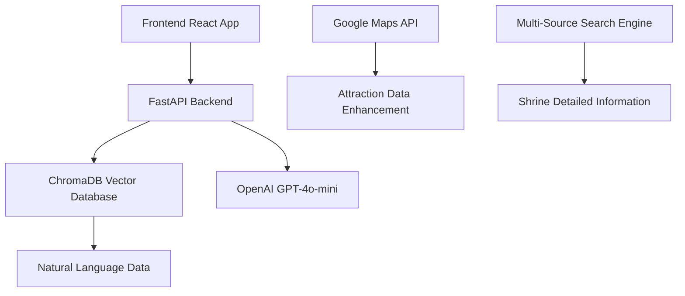

# Fukui Tourism AI Assistant 🏯

> A modern tourism assistant combining AI-powered Q&A with interactive maps, designed for exploring shrines and tourist attractions in Fukui Prefecture, Japan


## ✨ Project Overview

The Fukui Tourism AI Assistant is a full-stack **Web** application that provides intelligent Q&A services for shrines and tourist attractions in Fukui Prefecture through AI technology. It integrates vector database technology with natural language processing to provide accurate and relevant tourism information.

### 🎯 Core Features

- 🤖 **AI-Powered Q&A** - Provides accurate tourism information through GPT-4o-mini
- 🗺️ **Interactive Maps** - Visualizes attraction locations and related information
- 🔍 **Vector Semantic Search** - Uses ChromaDB for precise content search
- 📱 **Responsive Interface** - Modern user experience design
- 🌍 **Location-Aware** - Intelligent attraction recommendations based on distance

---

## 🏗️ Technical Architecture



### Tech Stack

#### Frontend Technologies
- **React 18** + **TypeScript** - Modern frontend framework
- **Tailwind CSS** - Responsive design system
- **Framer Motion** - Smooth animation effects
- **Mapbox GL JS** - Interactive maps
- **Vite** - Fast build tool

#### Backend Technologies
- **FastAPI** - High-performance Python web framework
- **ChromaDB** - Vector database
- **OpenAI API** - GPT-4o-mini language model
- **Uvicorn** - ASGI server

#### Data Processing
- **Google Maps API** - Attraction data enhancement
- **Multi-Source Search Engine** - Integrates Google, Perplexity, OpenAI search
- **Natural Language Processing** - JSON to Markdown conversion

---

## 📦 Project Structure

```
Fukui Tourism AI Assistant/
├── 📱 Frontend Application (frontend/)
│   ├── src/
│   │   ├── components/          # React components
│   │   │   ├── ChatInterface.tsx     # Chat interface
│   │   │   ├── MapView.tsx          # Map view
│   │   │   ├── Header.tsx           # Header component
│   │   │   ├── QuickActions.tsx     # Quick actions
│   │   │   └── LoadingScreen.tsx    # Loading screen
│   │   ├── services/           # API service layer
│   │   │   └── api.ts              # API interface definition
│   │   └── App.tsx            # Main application
│   ├── package.json           # Node.js dependencies
│   └── vite.config.ts         # Vite configuration file
│
├── 📡 Backend Service (backend/)
│   ├── app.py                 # FastAPI main service
│   └── requirements.txt       # Python dependencies
│
├── 🗄️ Vector Database (chroma_db/)
│   └── [ChromaDB data files]
│
├── 🔧 Data Processing Tools (src/)
│   ├── JSON_Generator/        # JSON data generators
│   │   ├── Google_Map_API_Location.py   # Google Maps data extraction
│   │   └── Search_Engine_Shrine.py      # Shrine search engine
│   ├── Markdown_Generator/    # Markdown generators
│   │   ├── convert_all_to_natural_language.py  # Main controller
│   │   ├── location_to_natural_language.py     # Attraction conversion
│   │   └── shrine_to_natural_language.py       # Shrine conversion
│   └── Vector_Database/       # Vector database management
│       └── ChromaDB_v1.py            # ChromaDB manager
│
├── 📄 Data Files (data/ & output/)
│   ├── data/fukui_location.json      # Original attraction data
│   ├── data/shrines_detail.csv       # Shrine detailed data
│   ├── output/enhanced_shrines.json  # Enhanced shrine data
│   └── output/locations_natural_language.md  # Natural language data
│
├── 🚀 Automation Scripts
│   ├── start_dev_optimized.sh          # Development environment startup script
│   └── stop_dev.sh           # Service stop script
│
└── ⚙️ Configuration Files
    ├── .env                   # Environment variable configuration
    └── requirements.txt       # Global Python dependencies
```

---

## 🚀 Quick Start

### Prerequisites
- **Python 3.8+**
- **Node.js 16+**
- **OpenAI API Key**
- **Google Maps API Key** (Optional)

### 1. Environment Setup

```bash
# Clone the project
git clone <project-url>
cd src-LLM-Shrine

# Set up environment variables
cp .env.example .env
```

### 2. Configure API Keys

Edit the `.env` file:

```bash
# OpenAI API Configuration (Required)
OPENAI_API_KEY=your_openai_api_key_here

# Google Maps API Configuration (Optional)
GOOGLE_MAPS_API_KEY=your_google_maps_key_here
GOOGLE_API_KEY=your_google_custom_search_key_here
GOOGLE_ENGINE_ID=your_search_engine_id_here

# Other API Configuration
PERPLEXITY_API_KEY=your_perplexity_key_here
```

### 3. One-Click Launch 🎯

```bash
# Automatically install dependencies and start all services
./start_dev_optimized.sh
```

### 4. Open the Application

- **Frontend Interface**: http://localhost:3000
- **Backend API**: http://localhost:8000
- **API Documentation**: http://localhost:8000/docs

---

## 🎮 Feature Details

### 1. Data Extraction and Processing

#### Google Maps Data Enhancement Tool
```bash
cd src
python3 Google_Map_API_Location.py
```

**Features:**
- ✅ Automatic configuration loading from `.env` file
- ✅ API key validity verification
- ✅ Cost estimation and safety checks
- ✅ Duplicate data detection and skipping
- ✅ Automatic progress saving and recovery
- ✅ Complete error handling and retry mechanisms

#### Shrine Search Engine
```bash
cd src
python3 Search_Engine_Shrine.py
```

**Multi-source search integration:**
- 🔍 Google Custom Search API
- 🌐 Perplexity API  
- 🤖 OpenAI GPT-assisted processing
- 📊 Intelligent data integration and validation

### 2. Natural Language Conversion

#### Batch Conversion Tool
```bash
cd src
python3 convert_all_to_natural_language.py
```

**Conversion features:**
- 📝 JSON to Markdown format conversion
- 🏯 Structured shrine data processing
- 🗺️ Natural language attraction information
- 📋 Batch processing and progress tracking

### 3. Vector Database Management

#### ChromaDB Integration
```python
from src.Vector_Database.ChromaDB_v1 import ChromaDBManager

# Initialize database manager
manager = ChromaDBManager()

# Load data
manager.load_data_from_markdown()

# Perform queries
result = manager.query("What are the famous shrines in Fukui Prefecture?")
```

**Vector search features:**
- 🧠 Semantic understanding search
- 📍 Location-aware processing
- 🎯 High-precision matching
- ⚡ Fast response times

### 4. Web Application

#### Frontend Features
- 💬 Real-time chat interface
- 🗺️ Interactive map display
- 📱 Responsive design
- ✨ Smooth animation effects
- 🚀 Quick action buttons

#### Backend API
- 🔗 RESTful API design
- 📊 Automatic API documentation generation
- 🛡️ Complete error handling
- 📈 Performance monitoring

---

## 🆕 Latest Features

### Location-Aware Search

**Intelligent Geographic Recommendation System:**
✅ **Prioritize attractions in the same city** - Avoid recommending attractions that are too far apart  
✅ **Consider geographic distance** - Use Haversine formula for precise distance calculation  
✅ **Provide practical travel routes** - GPT suggests geographically coherent itineraries  
✅ **Intelligent location recognition** - Automatically identify cities and locations from user queries  

---

## 🛠️ Advanced Usage

### Manual Installation Steps

#### Backend Setup
```bash
cd backend
python3 -m venv venv
source venv/bin/activate
pip install -r requirements.txt
python app.py
```

#### Frontend Setup
```bash
cd frontend
npm install
npm run dev
```

### Data Update Process

1. **Update raw data**: Modify data files in the `data/` directory
2. **Reprocess**: Execute relevant processing scripts
3. **Update vector database**: Reload ChromaDB
4. **Restart services**: Use `./start_dev_optimized.sh` to restart

---

## 🔧 Troubleshooting

### Common Issues

**Q: Cannot connect to backend service**
```bash
# Check backend service status
curl http://localhost:8000/health
```

**Q: ChromaDB errors**
```bash
# Recreate database
rm -rf chroma_db/
python src/Vector_Database/ChromaDB_v1.py
```

**Q: API key issues**
- Verify API key settings in `.env` file
- Check if API services have enabled relevant features

---

## 📊 Performance Information

### System Requirements
- **Memory**: Recommended 4GB or more
- **Storage**: Approximately 500MB
- **Network**: Requires stable internet connection

### API Usage
- **OpenAI API**: Depends on Q&A frequency
- **Google Maps API**: Approximately 2 calls per attraction
- **ChromaDB**: Local vector search, no external calls

---

## 🔮 Future Plans

- [ ] Multi-language support (English, Chinese, Japanese)
- [ ] Real-time weather information integration
- [ ] User rating system
- [ ] Route planning functionality
- [ ] Mobile application version
- [ ] AR augmented reality features

---

## 📄 License

This project is licensed under the MIT License. See [LICENSE](LICENSE) file for details.

---

## 🤝 Contributing

Welcome to submit Issues and Pull Requests! Please ensure:

1. Code follows project style
2. Includes appropriate tests
3. Updates relevant documentation
4. Follows commit message conventions

---

## 📧 Contact

For any questions or suggestions, please contact through:

\- **Email**: jeff891108@gmail.comgi

---

<div align="center">

**Fukui Tourism AI Assistant** - Let AI guide you to explore the beauty of Fukui 🏯

Made with ❤️ for Fukui Tourism

</div>
