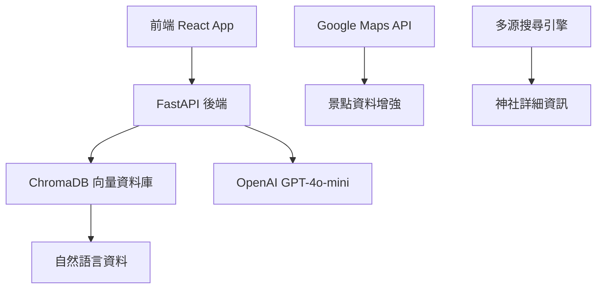

# 福井觀光智能助手 🏯

> 一個結合 AI 智能問答與互動式地圖的現代化觀光助手，專為探索日本福井縣的神社與觀光景點而設計


## ✨ 專案概述

福井觀光智能助手是一個全端 **Web** 應用程式，透過 AI 技術為使用者提供福井縣神社與景點的智能問答服務。整合了向量資料庫技術與自然語言處理，提供準確且相關的觀光資訊。

### 🎯 核心功能

- 🤖 **AI 智能問答** - 透過 GPT-4o-mini 提供準確的觀光資訊
- 🗺️ **互動式地圖** - 視覺化顯示景點位置與相關資訊
- 🔍 **向量語義搜尋** - 使用 ChromaDB 進行精準的內容搜尋
- 📱 **響應式介面** - 現代化的使用者體驗設計
- 🌍 **地理位置感知** - 基於距離的智能景點推薦

---

## 🏗️ 技術架構



### 技術棧

#### 前端技術
- **React 18** + **TypeScript** - 現代化前端框架
- **Tailwind CSS** - 響應式設計系統
- **Framer Motion** - 流暢動畫效果
- **Mapbox GL JS** - 互動式地圖
- **Vite** - 快速建構工具

#### 後端技術
- **FastAPI** - 高效能 Python Web 框架
- **ChromaDB** - 向量資料庫
- **OpenAI API** - GPT-4o-mini 語言模型
- **Uvicorn** - ASGI 伺服器

#### 資料處理
- **Google Maps API** - 景點資料增強
- **多源搜尋引擎** - 整合 Google、Perplexity、OpenAI **搜尋**
- **自然語言處理** - JSON 到 Markdown 轉換

---

## 📦 專案結構

```
福井觀光智能助手/
├── 📱 前端應用程式 (frontend/)
│   ├── src/
│   │   ├── components/          # React 元件
│   │   │   ├── ChatInterface.tsx     # 聊天介面
│   │   │   ├── MapView.tsx          # 地圖視圖
│   │   │   ├── Header.tsx           # 頁首元件
│   │   │   ├── QuickActions.tsx     # 快速動作
│   │   │   └── LoadingScreen.tsx    # 載入畫面
│   │   ├── services/           # API 服務層
│   │   │   └── api.ts              # API 介面定義
│   │   └── App.tsx            # 主應用程式
│   ├── package.json           # Node.js 相依套件
│   └── vite.config.ts         # Vite 設定檔案
│
├── 📡 後端服務 (backend/)
│   ├── app.py                 # FastAPI 主服務
│   ├── test_app.py           # 測試用 API 服務
│   └── requirements.txt       # Python 相依套件
│
├── 🗄️ 向量資料庫 (chroma_db/)
│   └── [ChromaDB 資料檔案]
│
├── 🔧 資料處理工具 (src/)
│   ├── JSON_Generator/        # JSON 資料產生器
│   │   ├── Google_Map_API_Location.py   # Google Maps 資料撷取
│   │   └── Search_Engine_Shrine.py      # 神社搜尋引擎
│   ├── Markdown_Generator/    # Markdown 產生器
│   │   ├── convert_all_to_natural_language.py  # 主控程式
│   │   ├── location_to_natural_language.py     # 景點轉換
│   │   └── shrine_to_natural_language.py       # 神社轉換
│   └── Vector_Database/       # 向量資料庫管理
│       └── ChromaDB_v1.py            # ChromaDB 管理器
│
├── 📄 資料檔案 (data/ & output/)
│   ├── data/fukui_location.json      # 原始景點資料
│   ├── data/shrines_detail.csv       # 神社詳細資料
│   ├── output/enhanced_shrines.json  # 增強後神社資料
│   └── output/locations_natural_language.md  # 自然語言資料
│
├── 🚀 自動化腳本
│   ├── start_dev.sh          # 開發環境啟動腳本
│   └── stop_dev.sh           # 服務停止腳本
│
└── ⚙️ 設定檔案
    ├── .env                   # 環境變數設定
    └── requirements.txt       # 全域 Python 相依套件
```

---

## 🚀 快速開始

### 前置需求
- **Python 3.8+**
- **Node.js 16+**
- **OpenAI API Key**
- **Google Maps API Key** (選用)

### 1. 環境設定

```bash
# 複製專案
git clone <專案網址>
cd src-LLM-Shrine

# 設定環境變數
cp .env.example .env
```

### 2. 設定 API 金鑰

編輯 `.env` 檔案：

```bash
# OpenAI API 設定 (必需)
OPENAI_API_KEY=your_openai_api_key_here

# Google Maps API 設定 (選用)
GOOGLE_MAPS_API_KEY=your_google_maps_key_here
GOOGLE_API_KEY=your_google_custom_search_key_here
GOOGLE_ENGINE_ID=your_search_engine_id_here

# 其他 API 設定
PERPLEXITY_API_KEY=your_perplexity_key_here
```

### 3. 一鍵啟動 🎯

```bash
# 自動安裝相依套件並啟動所有服務
./start_dev.sh
```

### 4. 開啟應用程式

- **前端介面**: http://localhost:3000
- **後端 API**: http://localhost:8000
- **API 文件**: http://localhost:8000/docs

---

## 🎮 功能詳解

### 1. 資料撷取與處理

#### Google Maps 資料增強工具
```bash
cd src
python3 Google_Map_API_Location.py
```

**功能特色：**
- ✅ 自動從 `.env` 檔案載入配置
- ✅ API 金鑰有效性驗證
- ✅ 成本估算和安全檢查
- ✅ 重複資料檢測和跳過
- ✅ 自動進度保存和恢復
- ✅ 完整的錯誤處理和重試機制

#### 神社搜尋引擎
```bash
cd src
python3 Search_Engine_Shrine.py
```

**多源搜尋整合：**
- 🔍 Google Custom Search API
- 🌐 Perplexity API  
- 🤖 OpenAI GPT 輔助處理
- 📊 智能資料整合與驗證

### 2. 自然語言轉換

#### 批次轉換工具
```bash
cd src
python3 convert_all_to_natural_language.py
```

**轉換功能：**
- 📝 JSON 轉 Markdown 格式
- 🏯 神社資料結構化處理
- 🗺️ 景點資訊自然語言化
- 📋 批次處理與進度追蹤

### 3. 向量資料庫管理

#### ChromaDB 整合
```python
from src.Vector_Database.ChromaDB_v1 import ChromaDBManager

# 初始化資料庫管理器
manager = ChromaDBManager()

# 載入資料
manager.load_data_from_markdown()

# 進行查詢
result = manager.query("福井縣有哪些著名的神社？")
```

**向量搜尋特色：**
- 🧠 語義理解搜尋
- 📍 地理位置感知
- 🎯 高精準度匹配
- ⚡ 快速回應時間

### 4. Web 應用程式

#### 前端功能
- 💬 即時聊天介面
- 🗺️ 互動式地圖顯示
- 📱 響應式設計
- ✨ 流暢動畫效果
- 🚀 快速操作按鈕

#### 後端 API
- 🔗 RESTful API 設計
- 📊 自動 API 文件產生
- 🛡️ 完整錯誤處理
- 📈 效能監控

---

## 🆕 最新功能

### 地理位置感知搜尋

**智能地理推薦系統：**
✅ **優先推薦同一城市的景點** - 避免推薦距離太遠的景點組合  
✅ **考慮地理距離遠近** - 使用 Haversine 公式精確計算距離  
✅ **提供實用的旅遊路線** - GPT 會建議地理上連貫的行程安排  
✅ **智能識別地點查詢** - 自動從使用者問題中識別城市和地點  

```bash
# 體驗地理感知搜尋
python3 demo_location_aware.py
```

---

## 🛠️ 進階使用

### 手動安裝步驟

#### 後端設定
```bash
cd backend
python3 -m venv venv
source venv/bin/activate
pip install -r requirements.txt
python app.py
```

#### 前端設定
```bash
cd frontend
npm install
npm run dev
```

### 資料更新流程

1. **更新原始資料**：修改 `data/` 目錄下的資料檔案
2. **重新處理**：執行相關的處理腳本
3. **更新向量資料庫**：重新載入 ChromaDB
4. **重啟服務**：使用 `./start_dev.sh` 重新啟動

---

## 🔧 疑難排解

### 常見問題

**Q: 無法連接到後端服務**
```bash
# 檢查後端服務狀態
curl http://localhost:8000/health
```

**Q: ChromaDB 錯誤**
```bash
# 重新建立資料庫
rm -rf chroma_db/
python src/Vector_Database/ChromaDB_v1.py
```

**Q: API 金鑰問題**
- 確認 `.env` 檔案中的 API 金鑰設定正確
- 檢查 API 服務是否啟用相關功能

---

## 📊 效能資訊

### 系統需求
- **記憶體**: 建議 4GB 以上
- **儲存空間**: 約 500MB
- **網路**: 需要穩定的網際網路連線

### API 使用量
- **OpenAI API**: 依問答頻率而定
- **Google Maps API**: 每個景點約 2 次調用
- **ChromaDB**: 本地向量搜尋，無外部調用

---

## 🔮 未來規劃

- [ ] 多語言支援 (英文、中文、日文)
- [ ] 即時天氣資訊整合
- [ ] 使用者評價系統
- [ ] 路線規劃功能
- [ ] 行動應用程式版本
- [ ] AR 擴增實境功能

---

## 📄 授權

本專案採用 MIT 授權條款。詳細資訊請參考 [LICENSE](LICENSE) 檔案。

---

## 🤝 貢獻指南

歡迎提交 Issue 和 Pull Request！請確保：

1. 程式碼符合專案風格
2. 包含適當的測試
3. 更新相關文件
4. 遵循 Commit 訊息規範

---

## 📧 聯絡方式

如有任何問題或建議，請透過以下方式聯絡：

- **GitHub Issues**: [專案 Issues 頁面]
- **Email**: [您的電子郵件]

---

<div align="center">

**福井觀光智能助手** - 讓 AI 帶您探索福井之美 🏯

Made with ❤️ for Fukui Tourism

</div>
